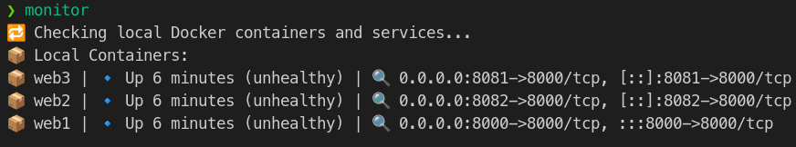
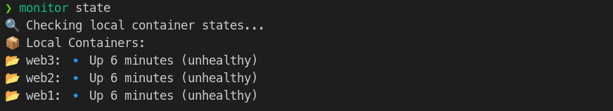
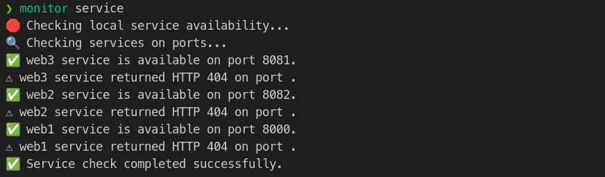

# Docker Container Monitor 🚀

[](https://github.com/Kobeep/Docker_Container_monitor/actions)

Docker Container Monitor is a lightweight CLI tool written in Go that monitors running Docker containers and their services. It provides real-time information about container states, checks service availability, and even supports remote monitoring via SSH. The project also includes a Python installer script for an automated setup.

---

## Table of Contents

- [Docker Container Monitor 🚀](#docker-container-monitor-)
  - [Table of Contents](#table-of-contents)
  - [Overview](#overview)
  - [Features](#features)
  - [Installation](#installation)
    - [Prerequisites](#prerequisites)
    - [Steps to Install](#steps-to-install)
  - [Usage](#usage)
    - [Display full container and service status:](#display-full-container-and-service-status)
    - [Display only container states:](#display-only-container-states)
    - [Display only service availability:](#display-only-service-availability)
    - [Monitor Docker containers on a remote host:](#monitor-docker-containers-on-a-remote-host)
    - [Monitor Docker events in real time:](#monitor-docker-events-in-real-time)
      - [For JSON output, use:](#for-json-output-use)
    - [Check systemd service status:](#check-systemd-service-status)
  - [How It Works](#how-it-works)
  - [Uninstallation](#uninstallation)
  - [Contributing](#contributing)
  - [License](#license)
  - [Author](#author)
  - [GitHub](#github)

---

## Overview

**Docker Container Monitor** is a powerful yet lightweight CLI tool designed to help you keep an eye on your Docker containers and the services running within them. With features ranging from automatic container detection to remote monitoring support via SSH, this tool makes it easy to ensure that your containerized applications are running smoothly.

---

## Features

- ✅ **Automatic container detection**
  No manual container naming needed.
- ✅ **Service health check**
  Automatically verifies the accessibility of container services.
- ✅ **Remote monitoring support**
  Monitor containers on remote hosts over SSH.
- ✅ **Real-time Docker events monitoring**
  Subscribe to Docker events for dynamic updates.
- ✅ **Multiple output modes**
  Choose from full status, container state, service availability, or event monitoring displays.
- ✅ **Simple CLI commands**
  Use `monitor` for an instant overview.
- ✅ **Systemd integration**
  Run as a background service for continuous monitoring.
- ✅ **Easy installation**
  Fully automated setup with `install.py`.

---

## Installation

### Prerequisites

- 🐳 **Docker** installed and running.
- 🐍 **Python 3** installed.
- 🦫 **Go** installed (the installer will install it automatically if not present).
- 🔑 **(Optional)** SSH access for remote monitoring:
  - A configured `~/.ssh/config` file, or
  - A private key for manual SSH authentication.

### Steps to Install

1. **Clone the repository:**

  ```sh
  git clone https://github.com/Kobeep/Docker_Container_monitor.git
  cd Docker_Container_monitor
  ```

2. **Run the installation script:**

```sh
python3 install.py
```

3. **Verify installation:**

```sh
monitor --help
```

## Usage
### Display full container and service status:

```sh
monitor
```



### Display only container states:

```sh
monitor state
```



### Display only service availability:

```sh
monitor service
```



### Monitor Docker containers on a remote host:

```sh
monitor remote --host <hostalias>
```

### Monitor Docker events in real time:

```sh
monitor events
```

#### For JSON output, use:

```sh
monitor events --json
```

### Check systemd service status:

```sh
systemctl status monitor
```

## How It Works

🚀 **Retrieves a list of running Docker containers** using `docker ps`
🔌 **Gets exposed ports** for each container
🌐 **Attempts an HTTP request** to determine if the service inside the container is responsive
🔔 **Subscribes to Docker events** for real-time monitoring.
📊 **Displays results** based on the selected mode

## Uninstallation

To remove the tool:
```sh
sudo systemctl stop monitor
sudo systemctl disable monitor
sudo rm /usr/local/bin/monitor
sudo rm /etc/systemd/system/monitor.service
rm -rf ~/Docker_Container_monitor
```
## Contributing

💡 Contributions are welcome! Feel free to submit a pull request or open an issue.

## License

📜 This project is licensed under the `GNU GPL License`.

## Author

👨‍💻 **Author:** Jakub Pospieszny

## GitHub

📌 **GitHub:** [Kobeep](https://github.com/Kobeep)
